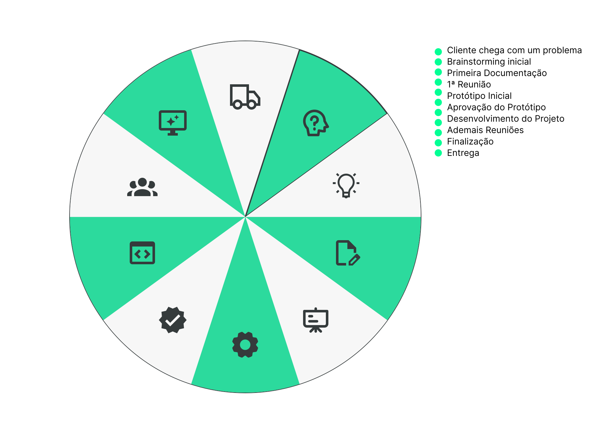

# Projeto Integrador - Fabrica.Build

Um modelo para o desenvolvimento do Projeto Integrador do Curso de Técnico em Desenvolvimento de Sistemas para a Internet Integrado ao Ensino Médio do IFC - Campus Araquari.

Alunos: [Carlos Eduardo](https://github.com/FaDoAdamSandler), [Gustavo de Paula](https://github.com/GustavodePaulaGorges) e [João Felipi](https://github.com/snow-sr)

Professores: [Marco André Mendes](github.com/marcoandre) e [Alann Perini](https://github.com/AlannKPerini).

Links do projeto:

-   [Documentação](github.com/FaDoAdamSandler/pi-modelo)
-   [Backend]()
-   [Frontend-Mockup](https://www.figma.com/file/XHktzx8KwSCYFRFMbHjZec/F%C3%A1brica-Build?node-id=0%3A1&t=sLv59h9FqwW3CUKk-1)

<!-- # Como usar esse modelo para o Projeto Integrador

1. Faça um fork desse repositório para a sua conta do GitHub.
2. Clone o repositório para o seu computador.
3. Abra o arquivo README.md no seu editor de texto favorito (recomendamos o [Visual Studio Code](https://code.visualstudio.com/)).
4. Tenha instalada a extensão [Markdown All in One](https://marketplace.visualstudio.com/items?itemName=yzhang.markdown-all-in-one) no seu editor de texto.
5. Edite o arquivo README.md com as informações do seu projeto. -->

<!-- # Desenvolvimento

-   As equipes serão avaliadas por cada etapa da documentação e entregas realizadas.
-   Cada equipe deverá escolher um sistema para o desenvolvimento das atividades, a partir dos modelos apresentados. -->

# Modelo de Sistema

<!-- **Nessa parte a equipe deve escolher um dos modelos de sistemas para desenvolver o projeto. Ao escolher, escreva uma breve descrição do sistema e o motivo da escolha e pode apagar os outros modelos.** -->

## 3 - Ordem de Serviço (O.S.)

**Gerenciamento da Fábrica de Software**

Um sistema para o gerenciamento de projetos desenvolvidos dentro da F.S (Fábrica de Software). Com meios de comunicação entre o coordenador do projeto e os alunos alocados. Ordem de serviço foi o modelo mais compatível com o tipo de sistema que queremos desenvolver, um sistema para o gerenciamento de um ambiente de trabalho.

# Introdução: 
A fábrica de software é responsável por desenvolver projetos em que alunos e professores trabalham juntos para resolver problemas reais. Coordenada atualmente por Ivo Riegel, a fábrica conta com 5 alunos e 4 professores que coordenam projetos, e existe a previsão para mais “contratações”.
 
# Situação-problema: 
O cliente entra em contato para a fábrica para apresentar um problema ou um projeto que precisa ser desenvolvido. Cada professor mantém em uma planilha os projetos que gerencia e define os alunos que estão aptos a desenvolver os projetos.
O professor responsável pelo projeto, necessita também fazer o gerenciamento, organização das tarefas, acompanhamento dos alunos, tudo sem uma plataforma   específica (em planilhas e anotações), gerando um transtorno por conta do déficit na eficiência na comunicação da coordenação com os alunos.

# Conclusão: 
Com base nos problemas analisados, o software iria auxiliar com a falta de organização do gerenciamento dos projetos, manter os registros de forma organizada, controle dos alunos bolsistas e facilitar o contato e o desenvolvimento entre equipes.

# Descrição da proposta

Baseado em todas as informações adquiridas com o cliente e a identificação dos problemas apresentados, buscamos apresentar uma proposta de desenvolvimento do software para sanar as dificultades de gerenciamento da fábrica.

Para o controle e gerenciamento dos projetos cadastrados no sistema, visando padronizar e melhorar a comunicação entre as equipes e o coordenador, além disso facilitar o cadastro dos novos alunos da fábrica, integrando-o com o gerenciamento dos projetos, assim obtendo maior eficiência e poupando tempo do coordenador

**Alguns pontos importantes a se destacar são:**

-   **Qual o foco de ação do software?** Permitir que os coordenadores possam ter uma interface padronizada para gerenciar seus atuais projetos relacionados a F.S, também podendo se comunicar com os alunos envolvidos, sobre o projeto, via um mural. 

-   **Os níveis de usuário do sistema**. Na fábrica, todos os funcionários possuem acesso ao sistema, exceto o PO (Product Owner). O sistema possui uma hierarquia de permissões que é composta por três níveis:

    -   **O primeiro nível é o administrador do sistema**, que possui permissões para remover, travar e alterar qualquer projeto no sistema, pode remover alunos inativos, adicionar novos alunos, definir reuniões gerais da fábrica, notificar atrasos de entregas e aplicar punições aos alunos inadimplentes.

    -   **O segundo nível é o gerente de projetos**, que tem a permissão de criar (no máximo 2), travar, remover e alterar projetos. Além disso, ele pode assimilar alunos aos seus projetos, marcar reuniões com suas equipes, notificar alunos de seu próprio grupo e remover alunos das equipes.

    -   **O terceiro nível é o usuário comum**, também conhecido como bolsista. Esse usuário possui permissões para editar os projetos em que está inscrito, enviar notas pelo "fábrica notes" e concluir tarefas.

# Regras de Negócio

* RN001 - Máximo de projetos: Um usuário de nível gerente de projetos deve ser capaz apenas de coordenar **2 Projetos** por vez. 

* RN002 - Máximo de bolsistas por projeto: Cada projeto pode contar com apenas **5 bolsistas** no máximo.

* RN003 - Publicação de Projetos: Apenas usuários de nível gerente de projeto ou maior podem fazer a publicação dos projetos nos domínios **fabricadesoftware.ifc.edu.br**

* RN004 - Criação de projetos: Os usuários com nível gerente ou maior podem criar projetos desde que não excedam a quantidade estipulada pela RN001

* RN005 - Máximo de projetos por Bolsista: Cada bolsista tem direito a participar de até 2 projetos simultaneamente.

* RN006 - Expulsão de Bolsistas: Apenas usuários com nível administrador podem expulsar/banir/privar bolsistas que saiam das regras.

* RN007 - Recrutamento de Bolsistas: Apenas usuários com nível administrador podem recrutar e inserir novos bolsistas no sistema.

* RN008 - Duração dos projetos: todos os projetos têm duração máxima de **1 ano (Um Ano)**, prorrogáveis em até **2 Anos (Dois Anos)**.

* RN009 - Exclusão de projetos: apenas o responsável pelo projeto pode excluir os projetos de sua responsabilidade.

* RN010 - Avisos no mural: só um gerente de projetos ou maior pode postar um aviso no mural.
   
# Requisitos Funcionais

* RF001 - Cadastro de projetos - O sistema deve permitir o cadastro de projetos para o gerenciamento da fábrica, incluindo informações como nome do projeto, descrição, equipe responsável e prazo de entrega.

* RF002 - Gerenciamento de projetos - O sistema deve permitir que os gerentes de projetos criem, editem, travem e removam projetos. Os gerentes de projeto também devem ser capazes de adicionar e remover membros da equipe e atribuir tarefas aos membros da equipe.

* RF003 - Hierarquia de permissões - O sistema deve permitir que o administrador defina a hierarquia de permissões com três níveis: administrador do sistema, gerente de projetos e usuário comum. Cada nível de permissão deve ter acesso a diferentes recursos e funcionalidades do sistema.

* RF004 - Gerenciamento de alunos - O sistema deve permitir que o administrador adicione novos alunos à fábrica e remova alunos inativos. O sistema deve permitir que o gerente de projeto assimile alunos aos seus projetos e remova alunos das equipes.

* RF005 - Comunicação - O sistema deve permitir a comunicação entre membros da equipe de um projeto, bem como entre os gerentes de projeto e os membros da equipe. Isso pode ser feito por meio de uma ferramenta de chat ou de e-mail integrado.

* RF006 - Fábrica Notes - O sistema deve permitir que os usuários enviem notas pelo "fábrica notes". Essas notas podem ser usadas para informar sobre o progresso do projeto, marcar reuniões ou informar sobre atrasos.

* RF007 - Controle de tarefas - O sistema deve permitir que os membros da equipe visualizem as tarefas atribuídas a eles e as concluam quando estiverem prontos. O sistema também deve permitir que os gerentes de projeto monitorem o progresso das tarefas e atribuam novas tarefas, se necessário.

* RF008 - Relatórios - O sistema deve permitir que os gerentes de projeto gerem relatórios sobre o progresso do projeto, o desempenho da equipe e o tempo gasto em cada tarefa. Esses relatórios podem ser usados para avaliar o desempenho da equipe e fazer melhorias no processo de gerenciamento do projeto.

# Requisitos Não Funcionais

* RNF001 - Segurança - o sistema deve ser protegido contra acesso não autorizado 
* RNF002 - Manuseabilidade - o sistema deve ser capaz de aumentar ou diminuir conforme necessário 
* RNF003 - Manuseablilidade - o sistema deve ser fácil de manter e atualizar 
* RNF004 - Segurança - o sistema deve ser confiável e atender aos requisitos do usuário 
* RNF005 - Compatibilidade - o sistema deve ser compatível com outros sistemas(como o Github)
* RNF006 - Compatibilidade - o sistema deve ser compatível com Linux e Windows 
* RNF007 - Atuação - o sistema deve ser capaz de lidar com múltiplos usuários simultâneos
* RNF008 - Manutenção - o sistema deve receber manutenções recorrentes
* RNF009 - Disponibilidade - o sistema deve ficar disponível 24 horas
* RNF010 - Banco de Dados - o sistema deve ter o banco de dados em django

